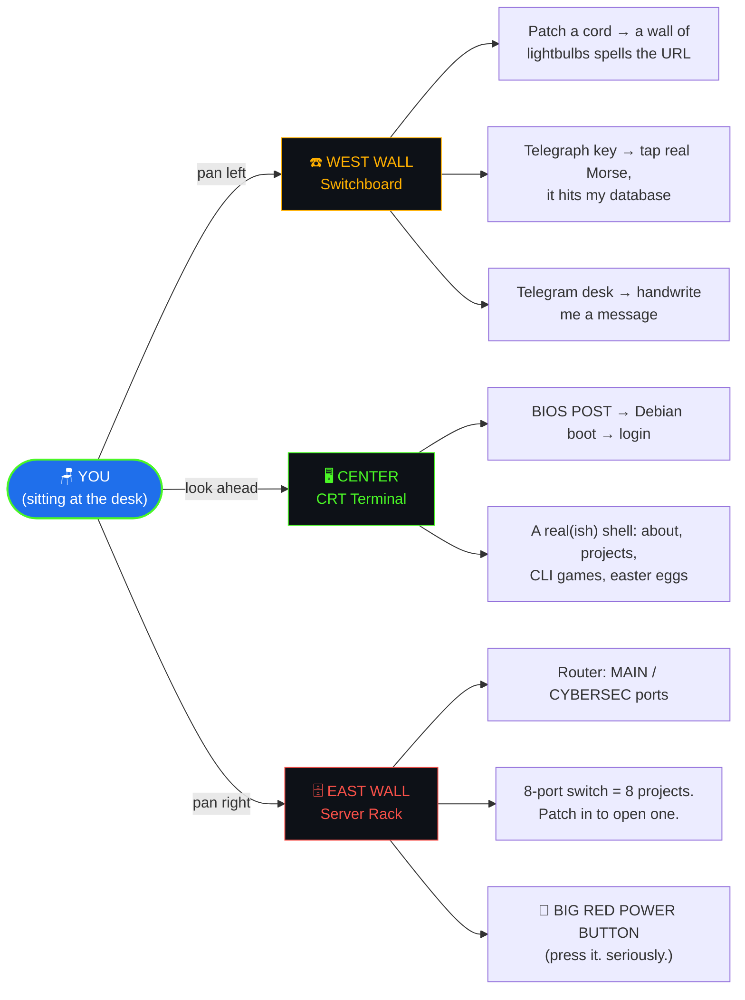

<!-- ═══════════════════════════════════════════════════════════════════
     4ttth — GitHub profile README
     Drop this file in the root of the repo github.com/4ttth/4ttth
     ═══════════════════════════════════════════════════════════════════ -->

<div align="center">


<a href="https://office.ssecka.tech">
  
</a>

<br />

[](https://office.ssecka.tech)
[](https://resume.ssecka.tech)
[](https://www.linkedin.com/in/fvolpindo)
[](https://www.credly.com/users/francisco-iv/badges/credly)
[](https://profile.hackthebox.com/profile/019f4c41-b563-72c6-8879-3d2c67cd3df6)
[](mailto:fourtholpindo@gmail.com)


</div>

---

## `$ boot`

```console
4TTTH BIOS v4.0.4 — Copyright (C) 2026, The 4th Floor
CPU: Human (1 core, heavily caffeinated)     Memory OK: 640K (should be enough)

Detecting drives ....... /dev/web    ONLINE
                         /dev/sec    ONLINE
                         /dev/sleep  NOT FOUND

theoffice login: guest
Password: ******
Last login: today, from somewhere on the internet

guest@theoffice:~$ whoami
Francisco "Fourth" Olpindo IV — developer, security enthusiast, professional
tinkerer. Cybersecurity student at Holy Angel University. I like retro
hardware, Linux, packet captures, and building rooms you can walk around in.

guest@theoffice:~$ _
```

---

## `$ tree ~/the-office`

> My portfolio isn't a page — it's a **room**. Fixed-camera, FNAF-style. Pick a wall.



<div align="center">

### 👉 [**office.ssecka.tech**](https://office.ssecka.tech) — every model is code, every sound is synthesized, no assets loaded.

</div>

---

## `$ ls ~/projects`

<table>
<tr>
<td width="50%" valign="top">

### 🛡️ `Palestrix`
**A gamified cybersecurity training platform.**
Spin up vulnerable machines, score flags, climb a ladder.

`Next.js` `FastAPI` `PostgreSQL` `Redis` `MinIO` `Proxmox VE` `Docker` `Caddy`

[](https://github.com/4ttth/Palestrix)
[](https://palestrix.ssecka.tech)

</td>
<td width="50%" valign="top">

### 🪟 `4thfolio`
**The office you're reading about.**
Three.js scene built entirely from primitives — verlet-rope patch cables, a curved scanlined CRT shader, WebAudio-synthesized everything.

`Three.js` `TypeScript` `Vite` `Appwrite`

[](https://office.ssecka.tech)

</td>
</tr>
<tr>
<td width="50%" valign="top">

### 🏋️ `CSIA Gym`
**A CTF platform for my university's security org.**
Where CSIA members train before the real competitions.

`Python` `Flask`

[](https://github.com/4ttth/csia-gym)

</td>
<td width="50%" valign="top">

### 📊 `AIO-SIEM`
**An all-in-one SIEM for enthusiasts like me.**
Because the good ones cost more than my laptop.

`Log pipelines` `Detection rules` `Self-hosted`

[](https://github.com/4ttth/AIO-SIEM)

</td>
</tr>
<tr>
<td width="50%" valign="top">

### 🧊 `Gleamair Enterprises`
**Shipped site for a real HVAC startup.**
Design + build + deploy, client-facing.

`HTML` `Tailwind CSS` `JavaScript`

[](https://gleamaire.com/)
[](https://github.com/4ttth/gleamair-4)

</td>
<td width="50%" valign="top">

### 🧰 `Tools4Team`
**Collaborate, track, analyze, and solve — one platform.**
Team tooling that didn't exist, so I made it.

`JavaScript` `Node.js`

[](https://github.com/4ttth/Tools4Team)

</td>
</tr>
</table>

<details>
<summary><b><code>$ ls ~/projects --all</code></b> &nbsp;· <i>the rest of the drawer (click)</i></summary>

<br />

| Project | What it is | Stack |
| --- | --- | --- |
| [`OPAC-SYSTEM`](https://github.com/4ttth/OPAC-SYSTEM) | Online public access catalog for a library | JavaScript |
| [`digital-news`](https://github.com/4ttth/digital-news) | News platform built on the MERN stack | MERN |
| [`Beat-Game-2`](https://github.com/4ttth/Beat-Game-2) | Rhythm game built for CLCTF | TypeScript |
| [`ai-radio`](https://github.com/4ttth/ai-radio) | An AI that runs a radio station | JavaScript |
| [`agapai-dev`](https://github.com/4ttth/agapai-dev) | In-progress product work | TypeScript |
| [`abyss`](https://github.com/4ttth/abyss) | Scrimmage / match management system | Python |
| [`4ttth-webshell`](https://github.com/4ttth/4ttth-webshell) | A web shell — for the lab, not for you | Python |
| [`6IOT-Backrest-Arduino`](https://github.com/4ttth/6IOT-Backrest-Arduino) | IoT posture-sensing backrest | C++ / Arduino |
| [`greedy_suite`](https://github.com/4ttth/greedy_suite) | Greedy-algorithm playground | Python |
| [`inventory-dweb`](https://github.com/4ttth/inventory-dweb) | Inventory system, self-hosted | PHP |
| [`fourthfolio`](https://github.com/4ttth/fourthfolio) | The portfolio before the office | Vue · Tailwind |
| [`HAUngman`](https://github.com/4ttth/HAUngman) | Hangman, but the dictionary is my university | Python |

…plus a shelf of coursework, CTF challenge sources, and half-finished
experiments I refuse to delete. Some of the good stuff is private — client
work, live CTF infrastructure, and challenge answer keys. Ask me about it.

</details>

---

## `$ cat ~/.experience`

<details open>
<summary><b><code>security</code></b></summary>

- 🚩 **CTF Developer & Challenge Author — CLCTF 2026** · wrote the challenges other people rage at
- 🦊 **CTF Player — CYBERFOXES AETHER & ENIGMA**, Holy Angel University
- 📦 **HackTheBox** — `sseccatoor` · boxes, seasons, and the occasional rage-quit
- 🎤 **Speaker — "Git Good: Cybersecurity Essentials 101"** · beginner security talk at a campus org event
- 🗂️ **4th Regional Cybersecurity Conference (Region 3, PH)** — built the registration system

</details>

<details>
<summary><b><code>leadership</code></b></summary>

- 🏛️ **Co-Chairperson, 2024 HAUSG Constitutional Commission**
- ☁️ **Founder & Lead — AWS Student Builders Group, HAU**
- 🎓 **Governor, HAU School of Computing Council (2024–2025)**
- 🛡️ **Cybersecurity Intelligence Alliance (CSIA)** — built the org's CTF gym and Discord infrastructure

</details>

<details>
<summary><b><code>skills</code></b> &nbsp;· <i>what's actually installed</i></summary>

<br />

**Languages**


**Frontend**


**Backend & Data**


**Security & Ops**


</details>

---

## `$ systemctl status github`

<div align="center">


</div>

---

## `$ ./snake --eat-my-contributions`

<div align="center">

<picture>
  <source media="(prefers-color-scheme: dark)" srcset="https://raw.githubusercontent.com/4ttth/4ttth/output/github-snake-dark.svg" />
  <source media="(prefers-color-scheme: light)" srcset="https://raw.githubusercontent.com/4ttth/4ttth/output/github-snake.svg" />
  
</picture>

</div>

---

## `$ ./ring-the-switchboard`

<div align="center">

**Patch a cord in. Any cord.**

<a href="mailto:fourtholpindo@gmail.com"></a>
<a href="https://www.linkedin.com/in/fvolpindo"></a>
<a href="https://x.com/fourtholpindo"></a>
<a href="https://www.instagram.com/franqfourth"></a>
<a href="https://www.facebook.com/FrncsIV"></a>


<br /><br />

Or **tap me in Morse** on the telegraph at [office.ssecka.tech](https://office.ssecka.tech) —
it's wired to a real database and I do read what comes in.

</div>

<details>
<summary><b><code>$ cat /var/log/easter-egg.log</code></b></summary>

<br />

```console
guest@theoffice:~$ sudo make me a sandwich
[sudo] password for guest: ******
Okay.

guest@theoffice:~$ ls -a ~/secrets
.  ..  .the-password-is-on-the-sticky-note

guest@theoffice:~$ ping motivation
PING motivation (127.0.0.1): 56 data bytes
Request timeout for icmp_seq 0
Request timeout for icmp_seq 1
64 bytes from 127.0.0.1: icmp_seq=2 ttl=64 time=3.2ms   <-- there it is

guest@theoffice:~$ # you scrolled this far. go press the big red button.
```

</details>

<div align="center">


</div>
